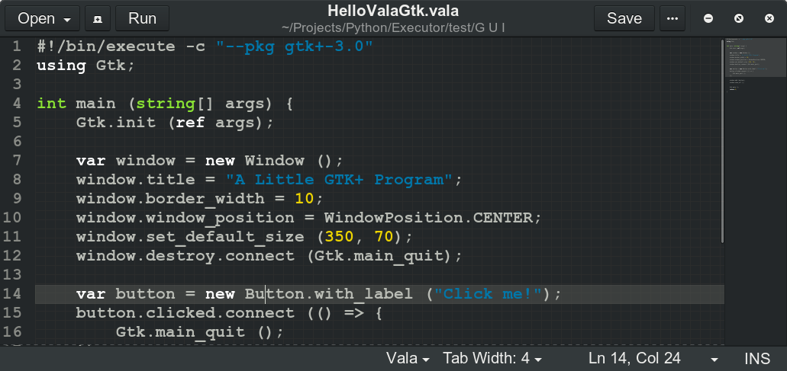

# Executor
Run everything like a script!

### Supported files
- C	(gcc)
- C++	(g++)
- C#	(mcs and mono)
- VisualBasic .NET   (vbnc and mono)
- Go	(gccgo)
- Rust	(rustc)
- Java	(javac)
- Kotlin    (kotlinc and java)
- Kotlin Script (kotlinc -script)
- Vala	(valac)
- Genie	(valac)
- TypeScript	(tsc and node)
- JavaScript    (node)
- Python    (python)
- GNU Octave    (octave)
- Intel Assembly (nasm)
- OCaml (ocamlopt)
- Shell (sh)
- AWK (awk)
- Perl (perl)

### Installation
```sh
$ sudo ./install
```
### Usage
```sh
$ execute hello.c
```
Or even better, add a shebang to your file
`test.vala`:
```c
#!/bin/execute
void main() { print ("Hello!\n"); }
```
```sh
$ chmod +x test.vala
$ ./test.vala
```
It's also possible to run a range of lines
```sh
$ ./test.ts --from 3 --to 5
```

One more cool feature! I leave you with examples:
```sh
$ execute -r Hello vala 'print (@"$(args[1]) from VALA\n")'
Hello from VALA
$ execute -r Hello c++ 'cout << argv[1] << " from CPP" << endl'
Hello from CPP
$ execute -r "1 1" c 'int i=atoi(argv[1]),j=atoi(argv[2]),k=i+j;printf("%d + %d = %d\n",i,j,k)'
1 + 1 = 2
```

### Gedit
Yes! it comes with a gedit plugin!

- Run `./install-gedit`
- Open gedit preferences -> plugins
- Enable Executor
- Enjoy 



### Add / Override
Create `.executor.json` in home directory. Example:
```json
{
    ".js": {
        "outFile": "'{sourceFile}'",
        "cm": "",
        "rn": "gjs {outFile}"
    }
}
```

### Clean up
Binaries will be generated under '~/.execs' directory. You can remove it manually if you wish.

### License
GPL

